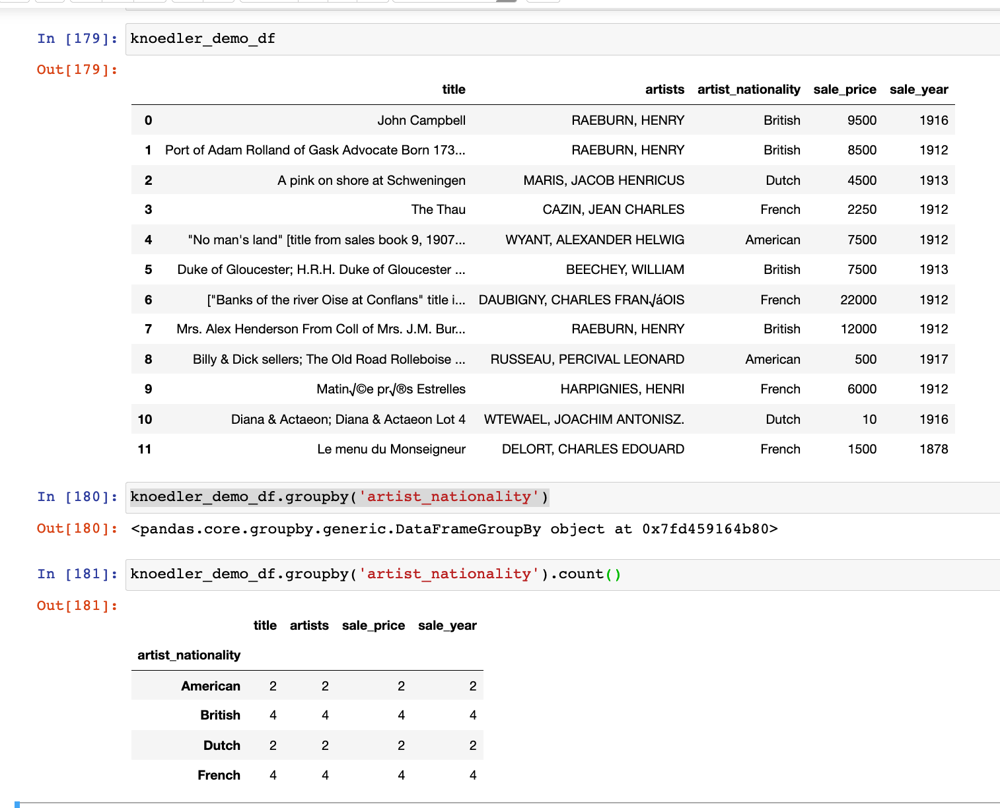

## More Advanced Pandas

There are a few more advanced pandas techniques that will come in handy for today's homework and for our in-class work on Thursday.

### Refrefsher on `groupby()` 

`groupby()` as we've learned in early lessons on pandas, is a powerful operation that allows us to to sort data 

Pandas documentation for using groupby [https://pandas.pydata.org/pandas-docs/stable/user_guide/groupby.html]

For instance, take this small sample data from the [NYC Knoedler dataset](https://github.com/mdlincoln/mapping-knoedler-palladio?tab=readme-ov-file#introduction-to-the-workshop-data). We can create dataframe from [the CSV](https://github.com/mdlincoln/mapping-knoedler-palladio/blob/master/nyc_knoedler.csv):

`knoedler_demo_df = pd.read_csv('../_datasets/knoedler-art-auction-dataset/nyc_knoedler.csv', encoding='utf-8')`

`knoedler_df`_ 

We could run `groupby('artist_nationality).counts()` to count the number of non-NaN rows with each given artist nationality (remember, `counts()` counts only rows with values in them)

Or we could group by "artist_nationality",  filter by "sale price", and calculate the TOTAL value of artworks sold by artists of each given nationality.

Or we could group by "sale_year",  filter by "sale_price", and calculate the TOTAL value of artworks sold in each year.

Or we could group by "sale_year",  filter by "artist_nationality", and calculate the number of paintings sold by artists of each nationality in each year. 

Or we could could group by "artist_nationality", filter by "sale_price"  and calculate the mean, median, and maximum sale prices  for artworks for each nationality

### `merge()` 

Sometimes your research data will be spread out across several different CSV files. Luckily enough, pandas has the capacity to bring different data frames into a single dataframe. The `merge()` operation allows us to combine two different data frames by "merging" along a shared key.

For instance, if we had two data frames, `dataframe1` and `dataframe2`, each of which shared a single column in common (a "key" column), we can merge on that column.

`pd.merge(dataframe1, dataframe2, on='title')`

### `plot()` 

We've already seen some and pandas plotting functions (see, for instance, the functions in [Introduction to Pandas, Exercise 2](https://mybinder.org/v2/gh/sceckert/introdhFall2022/main?urlpath=lab/tree/_week5/python-continued.ipynb) )

The plot function has several basic plotting operations operations. Skim through the plotting documentations to learn more about how to create the different kinds of visualizations: stacked bar charts, scatter plots, chart, etc: [https://pandas.pydata.org/pandas-docs/stable/user_guide/visualization.html](https://pandas.pydata.org/pandas-docs/stable/user_guide/visualization.html) We'll be talking much more about critical practices in data visualization later in the semester.

### `describe()`

To generate some basic statistics on the distribution and dispersion of values in our dataset (excluding NaN values), we can use the `describe()` function.

Take a look at the "Notes" and "Examples" section in the pandas guide: [https://pandas.pydata.org/pandas-docs/stable/reference/api/pandas.DataFrame.describe.html](https://pandas.pydata.org/pandas-docs/stable/reference/api/pandas.DataFrame.describe.html) 

### `corr()`

Sometimes we want to measure how related two sets of numerical data are to one one another (for instance, the relationship between the purchase price and sale price in a dataset of nineteenth-century art auction data). We can use the pandas `corr()` function to generate a a statistical hypothesis about a dataset and test that hypothesis. 

The first step in generating a hypothesis is making an assumption: is this going to rough follow a *linear* relationship, or some other kind of relationship? 

For test the linear correlation of two given variables, we can use the `corr()` method to get a sense of the type of linear relationship there is in the data––is it a it a positive one(if variable 1 goes up, variable 2 does as well), or a negative one (if variable 1 goes up, variable 2 goes down)––and the strength of that relationship (weak, strong, or none).

The general format for a linear, Pearson's correlation test in pandas: `df[['variable1, 'variable2']].corr(method='pearson)` 

For instance, let's say I wanted to see if there was a correlation between the purchase price and the sale price of 
`knoedler_df[['purchase_price, 'sale, price']].corr(method='pearson')` we get a correlation coefficient of 0.31924

we find that there is a weak positive relationship between the purchase price and sale price.

If you explore the pandas, you'll see that you can change the method for correlation from `method='pearson'` to  other methods of correlation testing: Spearman's [`method='spearman'`](which measures correlation in ranked data) and Kendall's tau [`method='kendall'`](which is a non-paramedic measure of ranked correlation). Take a look at [how these can be used in the pandas user guide](https://pandas.pydata.org/pandas-docs/stable/reference/api/pandas.DataFrame.corr.html) Note that these tests are a little more complicated than Peason's correlation coefficient.

#### A word of caution about correlation

+  Any good statistician will tell you that correlation does not equal causation! Just because you find a correlation between two variables does not mean one caused the other.

+ Correlations metrics do very poorly when we have small amounts of data (they can be very sensitive to outliers) 

What are we actually measuring when we calculate "correlation"? The technique was developed by Charles Darwin's erstwhile cousin, Francis Galton, who first arrived at the method as a way of describing heredity. Studying the French statistician Alphonse Bertillon's records on family features, Galton found himself walking backwards into a method for analyzing the statistical relationship between two sets of data when he was trying to develop a statistical description of the process of heredity. Karl Pearson took up the math and developed the mathematical formula for correlation that we now call "Pearson's correlation coefficient," which measures the covariance (how closely any two variables change together) of two variables divided by the product of their standard deviations. I say this not to suggest that we never use correlations, but that we understanding that correlation metrics work by presuming certain aspects of the underlying data (namely, that it follows certain linear characteristics). Correlation may tell us that two variables are related, but they do not tell us why, or the direction of that relationship.

(For more about the history of mathematical statistics, see [chapter 9](https://www.jstor.org/stable/j.ctvxcrz1v.19) of Theodore Porter's *The Rise of Statistical Thinking, 1820-1900* (1986) or [chapter 1, "Correlating Eugenics"](https://direct.mit.edu/books/book/5237/chapter/3468642/Correlating-Eugenics) in Wendy Chun's *Discriminating Data: Correlation: Neighborhoods, and the New Politics of Recognition* (2021) )

