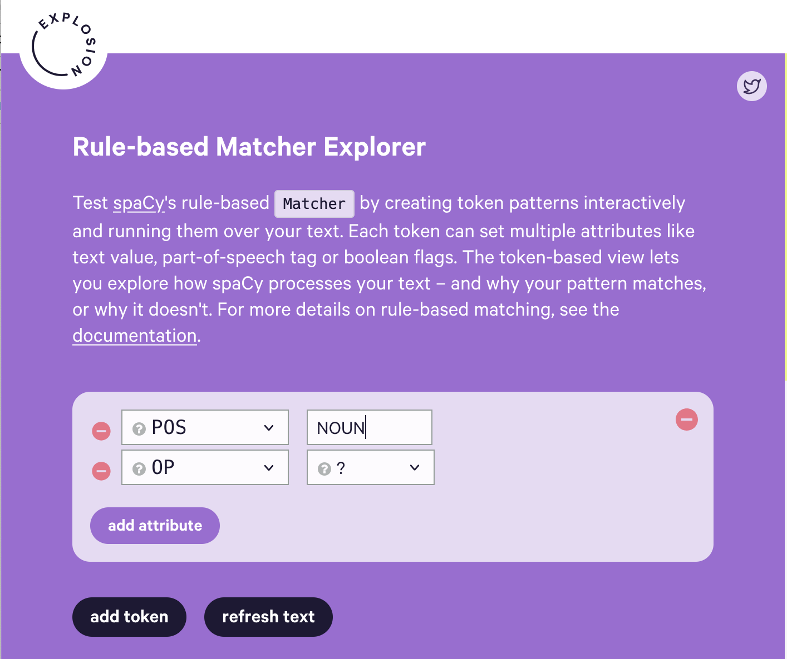

# In-class practicum: Detecting Persons, Places, and Things in a Text

### I. Finding persons and places in an Arthur Conan Doyle short story

With a partner:

+ Locate a plain text version of your chosen text––either the [plain text version of the Sherlock Holmes story you read](https://sherlock-holm.es/ascii/), or another detective story from the Birth of the Modern Detective Story [corpus of texts](https://github.com/ahmmnd/BMDS/tree/main/texts).
+ Open the text and copy it.
+ Navigate to https://demos.explosion.ai/displacy-ent 
+ Paste just your text into the demo box and click the magnifying glass icon to run the demo.
    + What does it produce?
    + Explore what the model tags as various entities (persons, “geopolitical entities”, works of art)
    + What does the model get WRONG? 
    + What might we say about its underlying assumptions?
    + What else do we notice about this mode of reading?
 
> Side note: what is `spacCy`'s Named Entity Recognition? It’s a machine learning model –in this case, one trained on a corpus of newswires–-designed to detect “named entities” –persons, places, sometimes specific units of money. (An entity is whatever the person construction the model tagged). In this model, entities include “GPE: Geopolitical Entities”, LOC (other locations), Persons, NORP: (Nationalities, organizations and religious groups)

This is a a demo. To generate a full, tagged set of places, persons, or other named entities, their locations in the text (and even small chunks of text around each entity) for further analysis, see our Jupyter Notebook:  [Finding Persons and Places in *The Adventures of Sherlock Holmes*](https://colab.research.google.com/drive/1r6noBWarLZCdjB2y3qYjl4MDIM_GhgWU?usp=sharing)

### Finding "things" (nouns) in an Arthur Conan Doyle short story

`spaCy` also has a simpler model for classifying parts of speech in a text.

With your same partner:

+ Navigate to https://demos.explosion.ai/matcher?
+ Change the rules: delete bottom two token boxes ("LEMMA" : match" and "LEMMA:" be) by clicking on the red minus sign in the upper-right hand corner. Change the part-of-speech in the top box to "NOUN", like so: 
+ Paste just the text of your chosen Arthur Conan Doyle short story into the demo box and click the magnifying glass icon to run the demo.
    + What do we notice?
    + What else could we say about this mode of reading?